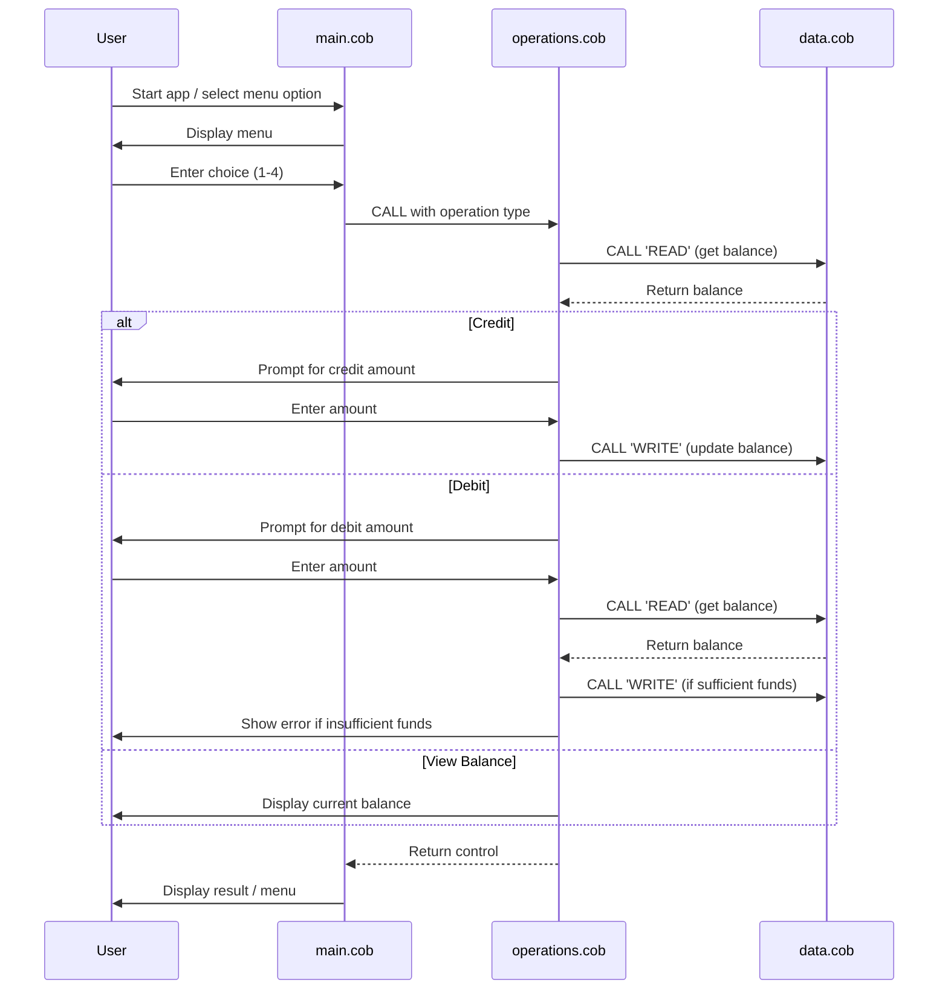

# COBOL Student Account Management System

This project is a simple COBOL-based system for managing student accounts, including viewing balances, crediting, and debiting funds. The system is composed of three main COBOL files, each with a specific role:

## COBOL File Overview

### 1. `main.cob`
**Purpose:**
- Acts as the entry point and user interface for the account management system.
- Presents a menu to the user with options to view balance, credit, debit, or exit.
- Handles user input and delegates operations to the `operations.cob` module.

**Key Logic:**
- Loops until the user chooses to exit.
- Uses `CALL` statements to invoke operations based on user choice.

### 2. `operations.cob`
**Purpose:**
- Implements the core business logic for account operations.
- Handles three main operations: viewing total balance, crediting, and debiting the account.

**Key Functions:**
- Receives the operation type from `main.cob` via the linkage section.
- For 'TOTAL', reads and displays the current balance.
- For 'CREDIT', prompts for an amount, adds it to the balance, and updates storage.
- For 'DEBIT', prompts for an amount, checks for sufficient funds, subtracts if possible, and updates storage.
- Calls `data.cob` for persistent balance storage and retrieval.

**Business Rules:**
- Debit operations are only allowed if sufficient funds are available; otherwise, an error message is displayed.

### 3. `data.cob`
**Purpose:**
- Manages persistent storage of the account balance.
- Provides read and write operations for the balance.

**Key Functions:**
- For 'READ', returns the current stored balance.
- For 'WRITE', updates the stored balance with the new value.

**Business Rules:**
- The balance is initialized to 1000.00 by default.
- Only the `operations.cob` module should modify the balance through this interface.

---

## Business Rules Summary
- **Initial Balance:** Student accounts start with a balance of 1000.00.
- **Credit:** Any positive amount can be credited to the account.
- **Debit:** Debits are only allowed if the account has sufficient funds; otherwise, the operation is denied.
- **Data Integrity:** All balance changes are routed through the `data.cob` module to ensure consistency.

---

## Sequence Diagram: Data Flow

For more details, see the source code in `/src/cobol/`.
